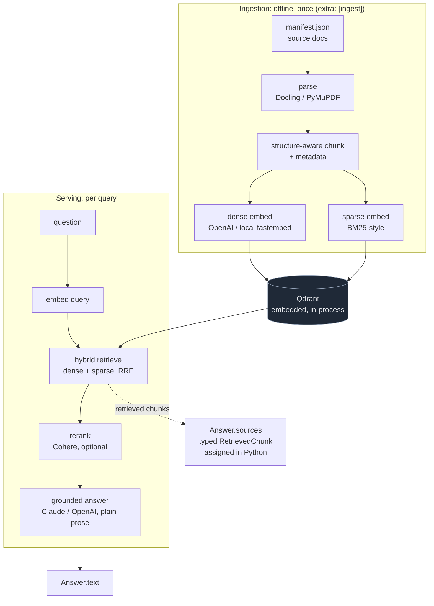

# accurag

[](https://github.com/larioscow/accurag/actions/workflows/ci.yml)
[](https://larioscow.github.io/accurag/)
[](https://www.python.org/)

[Documentation site](https://larioscow.github.io/accurag/): guides, architecture, and an auto-generated API reference.

accurag is a retrieval-augmented generation library you import or run from the CLI. Point
it at a corpus and it fetches, parses, chunks, embeds, and indexes the documents, then
answers questions over them with grounded, source-attributed responses.

It has four commands (ingest, retrieve, ask, evaluate) and one strategy switch (`dense`,
`hybrid`, or `hybrid_rerank`). Source attribution is deterministic: the sources returned
with an answer are the retrieved chunks themselves, assigned in Python. The model never
reports them, so there are no hallucinated citations.

It ships with a 47-document sample corpus of AI/RAG papers so you can run it out of the box,
and it ingests any corpus you point it at through a manifest (see [Ingesting a
corpus](#ingesting-a-corpus)).

---

## Install

```bash
git clone <this repo> && cd accurag
python3.12 -m venv .venv && source .venv/bin/activate
pip install -e ".[ingest]"          # parsers (Docling + PyMuPDF) live behind this extra
cp .env.example .env                # add your keys (see Configuration)
```

Requires Python 3.12. Qdrant runs embedded in-process, so there is no separate service to
start, and everything runs on CPU.

## Quick start

From Python:

```python
from accurag import RagPipeline

rag = RagPipeline()
rag.ingest("corpus/manifest.json")                    # parse → chunk → embed → index
hits = rag.retrieve("question", strategy="hybrid")     # ranked chunks, no LLM
ans  = rag.ask("question", strategy="hybrid_rerank")   # grounded Answer + sources
print(ans.text)                                        # plain prose, no inline markers
for s in ans.sources:                                  # typed RetrievedChunk provenance
    print(s.chunk.source_title, s.chunk.url, s.score)
```

From the CLI (`pip install -e` installs the `accurag` command):

```bash
accurag ingest --parser docling
accurag ask "How does reciprocal rank fusion work?" --strategy hybrid
accurag evaluate data/golden/golden.jsonl --answer-quality
```

### Running without API keys

`--embedder local` swaps OpenAI for a local model (fastembed, CPU-only), so ingest and
retrieve run with no key and no network:

```bash
accurag ingest --parser pymupdf --embedder local
accurag evaluate data/golden/golden.jsonl --embedder local --strategies dense,hybrid
```

This is offline for ingest and retrieval. Answering (`.ask`) still needs a hosted LLM.

---

## Ingesting a corpus

A corpus is a `manifest.json` that lists the source documents. accurag fetches each
`pdf_url`, parses it, and indexes the result. Each entry maps to a `ManifestEntry`:

```json
{
  "documents": [
    {
      "id": 1,
      "title": "Retrieval-Augmented Generation for Knowledge-Intensive NLP Tasks",
      "authors": "Lewis et al.",
      "year": 2020,
      "pdf_url": "https://arxiv.org/pdf/2005.11401",
      "source": "arxiv",
      "theme": "rag_foundations",
      "has_tables_or_figures": true,
      "verified": true,
      "note": "optional"
    }
  ]
}
```

Required fields: `id`, `title`, `authors`, `year`, `pdf_url`, `source` (`arxiv`, `vendor`,
or `other`), `theme` (a free-form category you can later filter on), `has_tables_or_figures`,
and `verified`. `arxiv_id`, `doi`, and `note` are optional. For your own documents, set
`source` to `vendor` or `other` and point `pdf_url` at the file.

Point the pipeline at your manifest:

```bash
accurag ingest --manifest path/to/your/manifest.json --parser docling
```

```python
rag.ingest("path/to/your/manifest.json")
```

Use `--parser pymupdf` for faster, lighter extraction, or `--parser docling` for
structure-aware parsing of tables and multi-column layouts. `--limit N` ingests only the
first N documents, and `--vision` also reads figures and charts into text chunks.

---

## How it works

Ingestion and serving are two halves joined by the Qdrant index. Ingestion is offline and
heavy (it runs a parser), so the parsing SDKs sit behind an optional extra and a serving
install does not carry them. Serving is fast and never touches the parser.



`Answer.sources` is wired from the retrieved chunks, not from anything the generator emits
(the dotted edge above). The generator writes plain prose and the prompt forbids it from
emitting citations, so a consumer gets sources as typed data rather than a string to parse
out of the answer.

The code is about 19 small modules. Each stage is a typed function, and strategy selection
is an `if/elif` over three named functions. `pipeline.py` is the only file that wires them
together. Retrieval returns `RetrievedChunk{chunk, score, rank}`.

---

## Choosing a strategy

The strategy switch trades recall, ranking, and latency. Measured on the sample corpus (25
Q&A, 47 documents, Docling parser):

| Config | Faithfulness | Answer Rel. | Recall@5 | MRR | P95 Latency (ms)* |
|---|---|---|---|---|---|
| `dense` | 0.988 | 0.776 | 0.867 | 0.803 | 670 |
| `hybrid` (dense+sparse, RRF) | 0.978 | 0.776 | **0.947** | 0.828 | 454 |
| `hybrid_rerank` (+ Cohere) | 0.984 | **0.808** | 0.933 | **0.861** | 1208 |

\* Rerank's 1208 ms is inflated by a Cohere trial key (10 calls/min, backoff under load),
not by the reranker itself. Treat dense and hybrid (~0.5 s) as representative. Latency is
indicative, not benchmarked.

- `dense`: vector search only. Simplest and cheapest.
- `hybrid`: adds sparse lexical matching to catch exact terms and numbers. Best recall@5.
- `hybrid_rerank`: reranks the fused candidates with Cohere, floating the best chunk to
  rank 1. Best MRR, at a small recall cost and higher latency.

Faithfulness stays around 0.98 across all three, since the grounded prompt answers only from
the retrieved context or returns "I don't know." The full breakdown (chunk-level recall,
parser A/B, chunk-size sweep) is in [`docs/EVAL_RESULTS.md`](docs/EVAL_RESULTS.md).

---

## Configuration

Settings are read from the environment (prefix `ACCURAG_`) or passed to `RagPipeline(...)`.

| Variable | Used for | Required? |
|---|---|---|
| `OPENAI_API_KEY` | embeddings + the eval judge | no (`--embedder local` avoids it) |
| `ANTHROPIC_API_KEY` | answer generation (Claude) | for `ask`, or pass `--llm openai` |
| `COHERE_API_KEY` | reranking | only for `hybrid_rerank` (a free trial key works) |

Everything is per-instance, with no globals, so you can run several pipelines in one
process:

```python
docs = RagPipeline(collection="my_docs")                  # different corpus
fast = RagPipeline(embed_model="text-embedding-3-small")  # cheaper embeddings
rag  = RagPipeline(llm=OpenAILLM(), reranker=my_cohere_client)  # swap any piece
```

Dependencies: 8 declared core packages. Heavy parsing, eval, and observability SDKs sit
behind optional extras with lazy in-function imports, so `import accurag` is key-free and
cheap. The eval uses a dependency-free LLM judge, so there is no LangChain in the core path.

---

## Development

```bash
pip install -e ".[dev]"
python -m pytest -q          # 140 tests, no API keys or network required (fakes + in-memory Qdrant)
```

ruff and mypy pass clean, and CI runs them. The pipeline is built from small,
single-responsibility modules under `src/accurag/`; `pipeline.py` is the only file that
wires them together. Heavy SDKs are imported lazily, so `import accurag` is cheap and
key-free.
