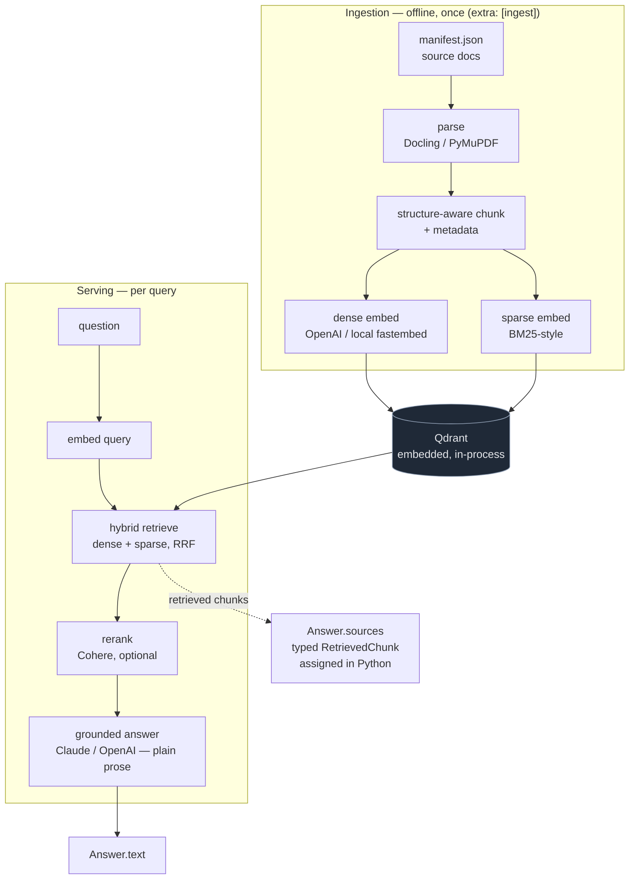

# Architecture

accurag is two halves joined by exactly one thing: the Qdrant index. Ingestion is
slow, heavy, and offline — it runs a parser. Serving is fast and never touches the
parser. The parsing SDKs live behind an optional `[ingest]` extra, so a serving-only
install doesn't carry them.



The dotted edge is the load-bearing design choice: `Answer.sources` is wired straight
from the **retrieved chunks**, not from anything the generator emits. See
[Deterministic sources](#deterministic-sources) below.

## The ingest / serving split

Two halves, decoupled at the module level and joined only by the Qdrant index:

- **Ingestion** is offline and runs once. It fetches the corpus, parses each document
  (Docling or fast PyMuPDF extraction), chunks structure-aware with metadata, and
  writes dense + sparse embeddings into Qdrant. The parsing SDKs (Docling, PyMuPDF,
  tiktoken) sit behind the `[ingest]` extra and are imported lazily inside `ingest()`,
  so they are not a cost on a serving install.
- **Serving** is per-query and never touches the parser. It embeds the query, runs
  hybrid retrieval (dense + sparse, RRF), optionally reranks, then builds a grounded
  answer.

The contract between the two halves is the embedder ↔ collection pairing: ingest and
query must use the same embedder, and retrieval fails loudly if the query vector's
dimension doesn't match the collection's dense dimension (guarding against, say, an
OpenAI 3072-dim query hitting a 384-dim local-fastembed index).

## Module map

The internals are deliberately legible: **~19 small modules** under `src/accurag/`,
each stage a plain typed function. There is no plugin registry and no dynamic dispatch.

| Module | Stage |
|---|---|
| `fetch` | load the manifest, fetch source files |
| `parse` | Docling structure-aware parse |
| `fastparse` | fast PyMuPDF text extraction (the parser A/B alternative) |
| `vision` | optional figure/chart → text chunks (best-effort) |
| `chunk` | structure-aware chunking + metadata |
| `embed` | dense embeddings (OpenAI or local fastembed) |
| `sparse_embed` | BM25-style sparse embeddings |
| `index` | build the Qdrant collection, upsert chunks |
| `retrieve` | `dense` and `hybrid` (dense+sparse, server-side RRF) |
| `rerank` | optional Cohere rerank over the fused candidates |
| `answer` | build the grounded `Answer` from retrieved context |
| `evaluate` | in-library metrics + LLM judge |
| `prompts` | the grounded-answer prompt |
| `llm` | `AnthropicLLM` (default) / `OpenAILLM` (fallback) |
| `models` | the Pydantic types crossing every boundary |
| `config` | per-instance `Settings` |
| `cli` | the four verbs from the command line |
| `pipeline` | the facade that wires it all together |

`pipeline.py` is the **only** file that wires the modules into one object
(`RagPipeline`). Every collaborator is injectable via the constructor and built lazily
on first real use, so `import accurag` — and constructing a pipeline with fakes — needs
no API keys and no network.

### Strategy selection is `if/elif`, not a registry

The one strategy switch — `dense | hybrid | hybrid_rerank` — is a literal `if/elif`
over three named functions in `RagPipeline.retrieve`. That switch *is* the comparison
the eval measures.

```python
if strategy == "dense":
    return retrieve.dense(...)
# hybrid + hybrid_rerank both need a sparse query vector
if strategy == "hybrid":
    return retrieve.hybrid(...)
# hybrid_rerank: over-fetch a deep candidate pool, then rerank down to k
fetched = retrieve.hybrid(..., k=max(k, candidates))
return rerank.rerank(query, fetched, top_n=k, ...)
```

`dense` is a single dense Qdrant query. `hybrid` runs two prefetch branches (dense and
sparse) fused server-side by Reciprocal Rank Fusion. `hybrid_rerank` over-fetches a
deep hybrid candidate pool and reranks it down to *k* with Cohere — and if nothing was
fetched, it returns early rather than build the Cohere client.

An unknown strategy raises `ValueError` before any work happens.

## Deterministic sources

The generator writes **plain prose**. The grounded prompt explicitly forbids it from
emitting citations. `Answer.sources` is set in Python to the exact `RetrievedChunk`
objects that were fed to the model — `ask()` retrieves, then `build_answer` returns
`Answer(text=..., sources=list(retrieved))`. The retrieved chunks *are* the sources.

```python
# answer.py — sources are the retrieved chunks, not the model's word
text = llm.answer(prompt)
return Answer(text=text.strip(), sources=list(retrieved))
```

A consumer (e.g. a NotebookLM-style UI) gets sources as typed data —
`source.chunk.source_title`, `.url`, `.section`, `.text`, `source.score`, `.rank` —
never as a string to parse out of the answer.

!!! warning "What this buys, qualified — because honesty is the point"
    It eliminates the **hallucinated / nonexistent-citation class entirely**: there is
    no model-reported chunk id to validate, because the model reports none.

    It does **not** catch a *wrong answer drawn from a real-but-bad chunk*. The source
    is guaranteed real and guaranteed to be the one used — not guaranteed to have been
    read correctly. There is a documented failure mode where vision-extracted chart
    numbers are mis-read and the answer comes back grounded but numerically wrong,
    faithful to a mis-extracted source. Deterministic provenance does not save you
    there.

## See also

- [Getting started](getting-started.md) — install, the four verbs, no-API mode.
- [API reference](reference/accurag/index.md) — every module and function in detail.
- [`EVAL_RESULTS.md`](EVAL_RESULTS.md) — the numbers these strategies produce.
